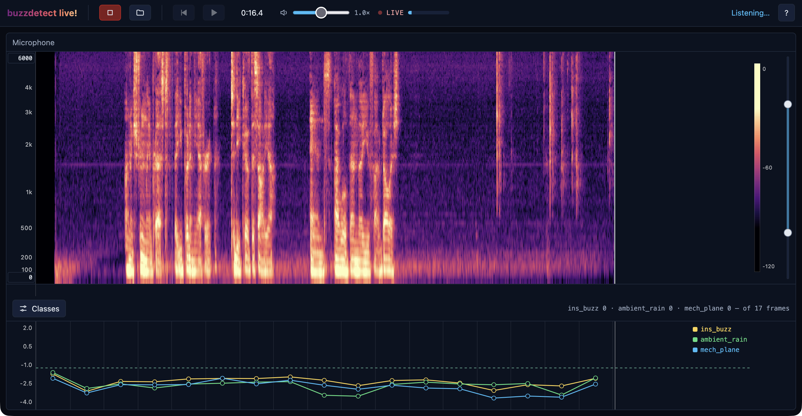

# buzzdetect live!


A playground for quickly running buzzdetect from your browser!

This is only a playground, I strongly recommend that you use [the real buzzdetect](https://github.com/OSU-Bee-Lab/buzzdetect) for real analyses. At the very least because I don't have a button to export results from the playground...

Currently, this runs a lightly quantized version of `yamnet_large_general`. Results should be pretty much numerically identical to the real deal. This model is experimental and hasn't been fully tested yet -- only a curated subset of its classes is offered, and its default threshold is a starting point rather than a settled number.

## What it do

You can open an existing audio file or else record live from your microphone. The audio will build into a spectrogram in the top panel, the model will be applied to the audio, and the model results are plotted to the lower panel. When recording, the spectrogram and results will stream in in real-time, which is cool.

All processing is local; the version I'm hosting at [lukehearon.com/buzzdetect-live](https://lukehearon.com/buzzdetect-live) doesn't ever upload anything!

Oh, it works on mobile, too!

```         
npm install
npm run dev      # http://localhost:5180
npm test         # parity against buzzdetect's own numbers
```

## How the model was built
This part was written by Claude. Here it is for good ol' posterity.

`tools/` runs in order. Steps 1, 2, 6 and 7 need the `buzzdetect` conda env and must run from the buzzdetect repo root; steps 3–5 need only `tools/.venv` (numpy, onnx, onnxruntime).

|  |  |
|------------------------------------|------------------------------------|
| `01_reference.py` | ground truth: runs real audio through buzzdetect's own path (`--model`, default `yamnet_large_general`) and saves waveform, log-mel, embeddings and activations. For a `yamnet_k2`-embedder model this also asserts `yamnet.keras` matches the `yamnet_k2` SavedModel (5.7e-6) — the export is invalid otherwise; `yamnet_large_general` uses `yamnet.keras` directly, so there's nothing to cross-check. |
| `02_extract_weights.py` | pulls raw layer weights to `.npz` + a JSON spec (`--model`, same default). No arithmetic. |
| `03_build_onnx.py` | builds the single graph: YAMNet's conv stack with the head's dense layer fused on. Folds BatchNorm, resolves TF `SAME` padding to explicit pads, applies the storage precision. |
| `04_verify_onnx.py` | ONNX vs SavedModel on identical patches. |
| `05_detections.py` | detection-count agreement at a threshold — flips, not just totals. |
| `06_fixtures.py` | binary fixtures for the TypeScript tests. |
| `07_sample.py` | the shipped demo clip and its reference activations. |

Rebuild the model with:

```         
tools/.venv/bin/python tools/03_build_onnx.py --precision mixed --mixed-from 4 --out buzzdetect_v3.onnx
cp tools/artifacts/buzzdetect_v3.onnx public/model/
```
